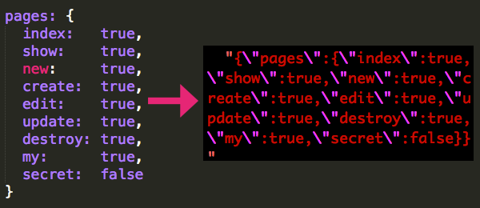

<h2 align="center" class='center' style="text-align:center">
  TheRole::Api. Role model and general API methods
</h2>

<p align="center" class='center' style="text-align:center">
  <b>Authorization gem for Ruby on Rails</b><br>
  <i>with <a href="https://github.com/TheRole/TheRoleManagementPanelBootstrap3">Management Panel</a></i>
</p>

<p align="center" class='center' style="text-align:center">
  
</p>

<p align="center" class='center' style="text-align:center">
  <b>Semantic. Flexible. Lightweigh</b>
</p>

<div align="center" class='center' style="text-align:center">

<a href="http://badge.fury.io/rb/the_role"></a>
&nbsp;
<a href="https://travis-ci.org/TheRole/DummyApp"></a>
&nbsp;
<a href="https://codeclimate.com/github/TheRole/TheRoleApi"></a>
&nbsp;
<a href="https://www.ruby-toolbox.com/categories/rails_authorization">ruby-toolbox</a>
</div>

### INTRO

TheRole is an authorization library for Ruby on Rails which restricts what resources a given user is allowed to access. All permissions are defined in with **2-level-hash**, and **stored in the database as a JSON string**.

<p align="center" class='center' style="text-align:center">
  
</p>

Using hashes, makes role system extremely easy to configure and use

* Any Role is a two-level hash, consisting of the <b>sections</b> and nested <b>rules</b>
* A <b>Section</b> may be associated with a <b>controller</b> name
* A <b>Rule</b> may be associated with an <b>action</b> name
* A Section can have many rules
* A Rule can be <b>true</b> or <b>false</b>
* <b>Sections</b> and nested <b>Rules</b> provide an <b>ACL</b> (<b>Access Control List</b>)

#### Import/Export

If you have 2 Rails apps, based on TheRole - you can move roles between them via export/import abilities of TheRole Management Panel.
It can be usefull for Rails apps based on one engine.

<div align="center" class='center' style="text-align:center">
  
</div>

## Installation

#### Gemfile

```ruby
# only API
gem 'the_role_api', '~> 3.0.0'
```

or

```ruby
# living on bleeding edge
gem 'the_role_api',
  github: 'TheRole/the_role_api',
  branch: 'master'
```

or

```ruby
# API and UI
gem 'the_role', '~> 3.0.0'
```

and after that

```sh
bundle
```

#### Change User migration file

Add a `role_id:integer` field to your User Model

```ruby
def self.up
  create_table :users do |t|
    t.string :login
    t.string :email
    t.string :crypted_password
    t.string :salt

    # !!! TheRole field !!!
    t.integer :role_id

    t.timestamps
  end
end
```

#### Install TheRole migration file

```sh
bundle exec rake the_role_engine:install:migrations
```

#### Invoke migrations

```sh
rake db:migrate
```

#### Change User model

```ruby
class User < ActiveRecord::Base
  # include TheRole::Api::User
  has_the_role

  # ... code ...
end
```

#### Create Role model

```sh
bundle exec rails g the_role install
```

#### Setup TheRole gem

<i>config/initializers/the_role.rb</i>

```ruby
TheRole.configure do |config|
  # [ Devise => :authenticate_user! | Sorcery => :require_login ]
  config.login_required_method = :authenticate_user!

  # config.default_user_role          = nil
  # config.first_user_should_be_admin = false

  # config.access_denied_method       = :access_denied
  # config.destroy_strategy           = :restrict_with_exception # can be nil
  # config.layout                     = :application             # layout for Management panel
end
```

#### Create admin role

```sh
rake db:the_role:admin
```

Now you can make any user an Admin via `rails console`, for instance:

```ruby
User.first.update( role: Role.with_name(:admin) )
User.first.admin? # => true
```

<hr>

<center>
  You are in deal!
  Thanks for using TheRole!
</center>

<hr>

### Integration with Rails controllers

<i>application_controller.rb</i>

```ruby
class ApplicationController < ActionController::Base

  include TheRole::Controller

  protect_from_forgery with: :exception
  protect_from_forgery

  # ... code ...
end
```

Any Rails controller, for instance, `pages_controller.rb`

```ruby
class PagesController < ApplicationController
  before_action :login_required, except: [ :index, :show ]
  before_action :role_required,  except: [ :index, :show ]

  # !!! ATTENTION !!!
  #
  # `@owner_check_object` variable have to be instantiated
  # before check ownership via `owner_required` method.
  #
  # You have to instantiate `@owner_check_object` in `set_page` method
  # See code below

  before_action :set_page,       only: [ :edit, :update, :destroy ]
  before_action :owner_required, only: [ :edit, :update, :destroy ]

  private

  def set_page
    @page = Page.find params[:id]

    # TheRole: object for ownership checking
    @owner_check_object = @page
  end
end
```

Please, learn simple source code of restriction methods:

0. <a href="https://github.com/TheRole/the_role_api/blob/master/app/controllers/concerns/the_role/controller.rb#L3">login_required</a>
0. <a href="https://github.com/TheRole/the_role_api/blob/master/app/controllers/concerns/the_role/controller.rb#L16">role_required</a>
0. <a href="https://github.com/TheRole/the_role_api/blob/master/app/controllers/concerns/the_role/controller.rb#L20">owner_required</a>

In this case `login_required` is a method `:authenticate_user!` from Devise gem

### Integration with Rails views

HAML views:

__case 1__

```haml
- if current_user

  - # if you are owner and has role
  - if current_user.owner?(@page) && current_user.has_role?(:pages, :edit)
    = link_to "Edit this Page", edit_page_path(@page)
```

__case 2__

```haml
- if current_user

  - if current_user.any_role?(social_networks: [:twitter_share_button, :facebook_share_button])
    %h3 You can share this content with Social Networks:

    - if current_user.has_role?(:social_networks, :twitter_share_button)
      = link_to 'Share with Twitter', '#'

    - if current_user.has_role?(:social_networks, :facebook_share_button)
      = link_to 'Share with Facebook', '#'

  - if current_user.moderator?(:pages)
    = link_to 'Manage Pages', admin_pages_path

  - if current_user.admin?
    = link_to 'Admin Panel', admin_path
```

### Using with Strong Parameters

```ruby
class PagesController < ApplicationController
  # .. code ...

  private

  def page_params
    permitted_keys = [:title, :intro, :content]

    permitted_keys.push(:tags)       if current_user.has_role?(:pages, :tags)
    permitted_keys.push(:top_secret) if current_user.admin?

    params.require(:page).permit(permitted_keys)
  end
end
```

## TheRole API

### User

```ruby
# User's role
@user.role # => Role obj
```

Is a user Administrator?

```ruby
@user.admin?                       => true | false
```

Is a user Moderator?

```ruby
@user.moderator?(:pages)           => true | false
@user.moderator?(:blogs)           => true | false
@user.moderator?(:articles)        => true | false
```

Has user got access to **rule** of **section** (action of controller)?

```ruby
@user.has_role?(:pages,    :show)  => true | false
@user.has_role?(:blogs,    :new)   => true | false
@user.has_role?(:articles, :edit)  => true | false

# return true if one of roles is true
@user.any_role?(pages: :show, posts: :show) => true | false
```

Is user **Owner** of object?

```ruby
@user.owner?(@page)                => true | false
@user.owner?(@blog)                => true | false
@user.owner?(@article)             => true | false
```

### Role

```ruby
# Find a Role by name
@role = Role.with_name(:user)
```

```ruby
@role.has?(:pages, :show)       => true | false
@role.moderator?(:pages)        => true | false
@role.admin?                    => true | false

# return true if one of roles is true
@role.any?(pages: :show, posts: :show) => true | false
```

#### CREATE

```ruby
# Create a section of rules
@role.create_section(:pages)
```

```ruby
# Create rule in section (false value by default)
@role.create_rule(:pages, :index)
```

#### READ

```ruby
@role.to_hash => Hash

# JSON string
@role.to_json => String

# check method
@role.has_section?(:pages) => true | false
```

#### UPDATE

```ruby
# set this rule on
@role.rule_on(:pages, :index)
```

```ruby
# set this rule off
@role.rule_off(:pages, :index)
```

```ruby
# Incoming hash is true-mask-hash
# All the rules of the Role will be reset to false
# Only rules from true-mask-hash will be set true
new_role_hash = {
  :pages => {
    :index => true,
    :show => true
  }
}

@role.update_role(new_role_hash)
```

#### DELETE

```ruby
# delete a section
@role.delete_section(:pages)

# delete a rule in section
@role.delete_rule(:pages, :show)
```

### Limitations by Design

TheRole uses few conventions over configuration.
It gives simplicity of code, but also some limitations.
You have to know about them before using of TheRole:

0. `User` **has only one** `Role`  (why?)
0. Only `User` model supported     (why?)
0. Based on `curent_user` method   (why?)
0. Role stored in database as a JSON String (why?)

### MIT License

Copyright (c) 2012-2015 [Ilya N.Zykin]
